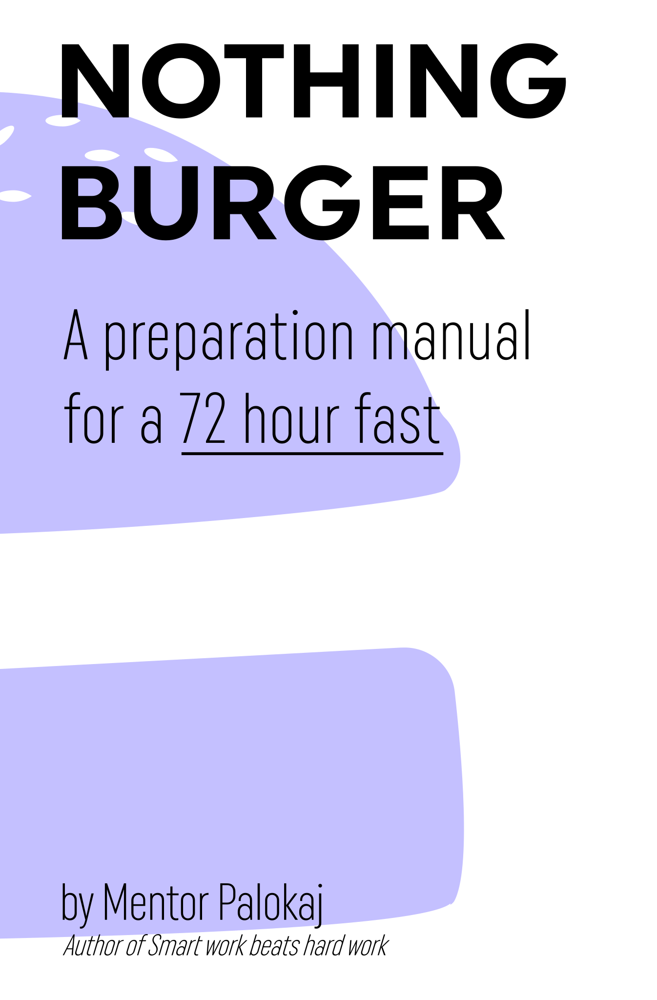
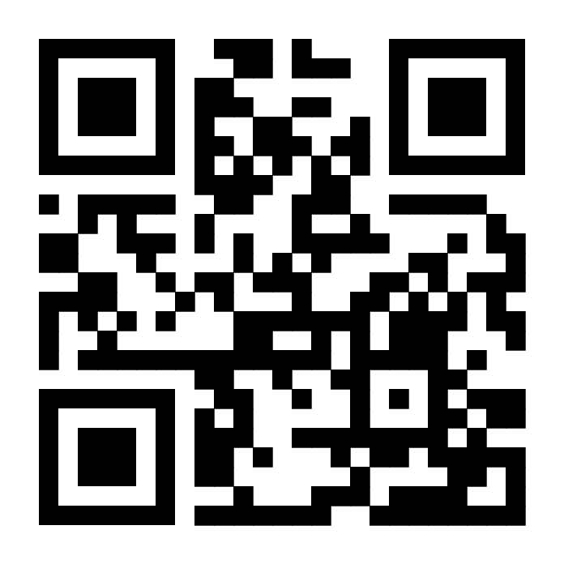

		

	    
		
    

	

		
This book was first published in 2023. The last known edit was on %%LASTEDIT%% (%%BOOKVERSION%%).

		
The content of this book is for educational purposes only. The author disclaims liability for any and all health, financial or other outcomes that may occur as a result of applying the methods suggested in this book.

		<!-- 
To access digital versions of this book please visit nothingburgerbook.com/claim.
 -->
		
Copyright 2023 by Mentor Antoni Palokaj. All rights reserved.

	

<!-- 

	

		<h1>Free stuff notice</h1>
		
Buyers of the physical book are entitled to a free digital pdf, kindle and kobo versions. Scan the QR code below or go to nothingburgerbook.com/claim on your phone.
 
		
	

 -->

	<h1>Acknowledgements</h1>
	
Many thanks to the people who provided feedback on the drafts of this book: Bram, Tom, Werner, Micho, Rudy. A special thanks to my wife Mylene, who has let me rant about blockchains to her for a good decade now, I'm sorry it wasn't just a phase love.

