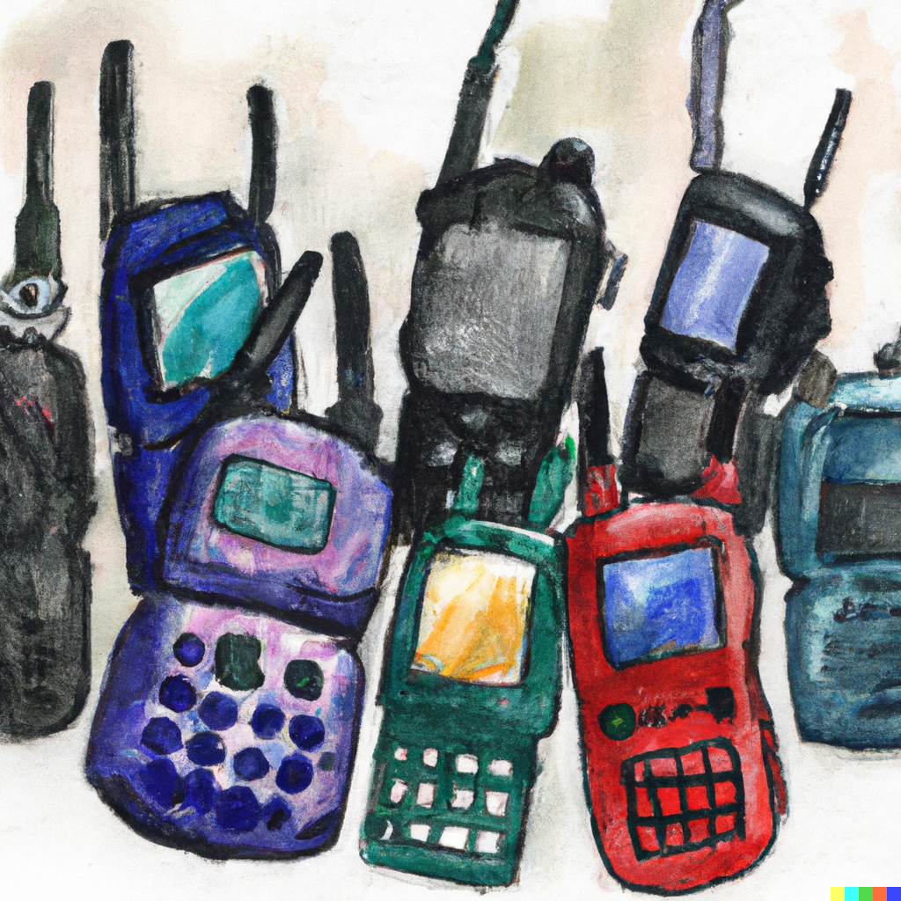

# Do you need a distributed network?

In a **centralised** system, nodes in a system do not talk to each other directly. An example of this is wifi: all your devices connect to your Wi-Fi network, but not to each other directly. If the router goes down, all your devices lose their wifi connection.

A **decentralised** network has multiple controlling nodes, that do not depend on each other but fulfil similar roles. An example of this are electricity grids: every city has one that is more or less the same, and they tend to be connected to each other. But if one city has a power outage, that doesn't mean all cities go dark.

A **distributed** network spreads its activity across its member nodes in a way that is so spread out that there are no single points of failure. An example of this are walkie talkies: if you have 50 of them, any one can fail but the rest can continue functioning just fine.

## Blockchains are distributed networks

Blockchains are more accurately described as "distributed ledgers". Which is why some people refer to them as DLT: **D**istrubuted **L**edger **T**echnology.

Blockchains are ledgers:

- a ledger is like a spreadsheet
- a blockchain is a type of ledger
- you can think of a blockchain as a spreadsheet with some superpowers

Here is how spreadsheet types differ:

- a **centralised** ledger is like having a spreadsheet that is saved on a USB stick. If you destroy the stick, you destroy the sheet.
- a **decentralised** ledger is like a Google Sheet: when you see it, it exists both on your laptop and several Google servers. If your laptop breaks, the sheet is still in the Google Cloud, if some computers at Google explode, the sheet is probably fine because they spread their data across servers
- a **distributed** ledger is like having a spreadsheet on a Dropbox-like system[^This is technically not true since Dropbox (and similar file systems) synchronise through central servers. So for the nitpickers: in this example, you may assume updates are transferred peer-to-peer]. Whenever someone changes the file on their computer, the file changes on all the other computers as well. If any of the computers break, the file is fine. In fact, the other users probably won't even notice. If you are a fellow-nerd, you are probably familiar with git, which is a good example of a distrubuted protocol[^Not to be confused with Github, which is a centralised provider of tooling for using the distrubuted git protocol].

Blockchains solve a collaboration problem: how do you make sure that the updates that people broadcast are legit? How do we make sure nobody cheats?

The name for the technology that keeps all copies of the blockchain in sync is a "consensus mechanism", and different blockchains use different ones. They are beyond the scope of this work. The most relevant thing to remember is that blockchains are distributed ledgers, which means:

- everyone who runs a blockchain node (for example wallet software on your laptop) has a full copy of the blockchain
- whenever someone creates a transaction in their local wallet software, they "update their local spreadsheet"
- the blockchain software makes sure all the other spreadsheets update with this new transaction, but only if the transaction doesn't break the rules of the blockchain

The above has some nuances[^Most importantly: most wallet software doesn't actually download the full blockchain because the "spreadsheet" is very big, rather they rely on a few trusted servers that keep a copy], but for your understanding of blockchain concepts, it is sufficient.

## Distributed ledger data storage is very robust

The advantage of having data stored on a blockchain is that it is very robust. In order to destroy the Bitcoin blockchain, for example, you would have to destroy all the copies of the Bitcoin ledger that exist, which is unfeasible.

Not only is it hard to delete, but if you want to somehow introduce a change that is counter to the rules, you would have to convince everyone who keeps a copy of the blockchain to play along.

In a centralised system, taking information down, or altering it, is very easy. You simply need to convince the person who owns the place where the information lives to change it. This is how totalitarian governments can censor news on the internet. It is how banks can block transactions they don't like. It's also how important archival data can be lost because it's only stored in one place.

## Distributed data storage comes at a cost

In their current design, blockchains work by keeping a copy of themselves on every computer that runs their software[^Again with nuances, most blockchains have levels of synchronisation. From "snapshot" sync that starts synchronising from the present day but doesn't sync history, to "full nodes" and "archive nodes" that synchronise the whole blockchain history.]. This is great for redundancy, but it comes at a cost. All those devices keeping the blockchain in sync means that a lot of resources are spent on synchronising a ledger.

In practice, this means that using a blockchain to store data is slow and expensive. Slow because all the devices across the world need to be kept in the loop about recent changes, and expensive because making transactions costs money. And the price of transactions is automatically set based on supply and demand. And supply is limited: if we need to keep all devices in the world in sync there is only so much data we can update per second. So the more demand there is for blockchain transactions, the more expensive they get.

## If you don't need a distributed network, blockchains are expensive

Blockchains are a slow and expensive way to keep a ledger synchronised across devices. The upside is that you have strong guarantees on the data always being available, but that availability comes at a price:

- storing 1GB of data on an [Amazon cloud server](https://aws.amazon.com/s3/pricing/) costs **$0.023**
- storing 1GB of data on [the Ethereum blockchain](https://ethereum.stackexchange.com/questions/872/what-is-the-cost-to-store-1kb-10kb-100kb-worth-of-data-into-the-ethereum-block) costs 32,000 ETH. Which at the time of writing is roughly **$64,000**

If you're going to use a blockchain to store data, it better well be worth the price. Things that are unlikely to make sense for example:

- storing photo backups on a blockchain
- storing product data on a blockchain
- storing documents on a blockchain

## Example: art NFTs

One of the more well-known hypes in the blockchain space is art NFTs. Put aside for now whether they are worth money. On a technical level, they do the following:

- create an entry on a blockchain saying "This entry of for art piece #42", where #42 is a unique identifier like a serial number
- to that entry add a note saying "The actual art image can be found at https://somewebsite.com/images/42.jpg"

Whenever someone transfers ownership of this NFT, the line in the blockchain spreadsheet that says who owns this NFT is now changed.

Because the data is on a distributed ledger, we have strong guarantees that we will always know who is the current registered owner of a certain NFT. Unlike with physical art, we can always see the serial number of an item, who owns that serial number, who have been owners in the past, and when they transferred ownership.

Whether having a robust record of who is the registered owner of a line in a spreadsheet has value in the real world is up to you.

I'll say that personally, this technology seems more suited to ownership titles of financial assets. Perhaps house deeds or the rights to the mortgage on the house. Especially in cases where centralised records cannot be trusted, places with weak rule of law for instance.