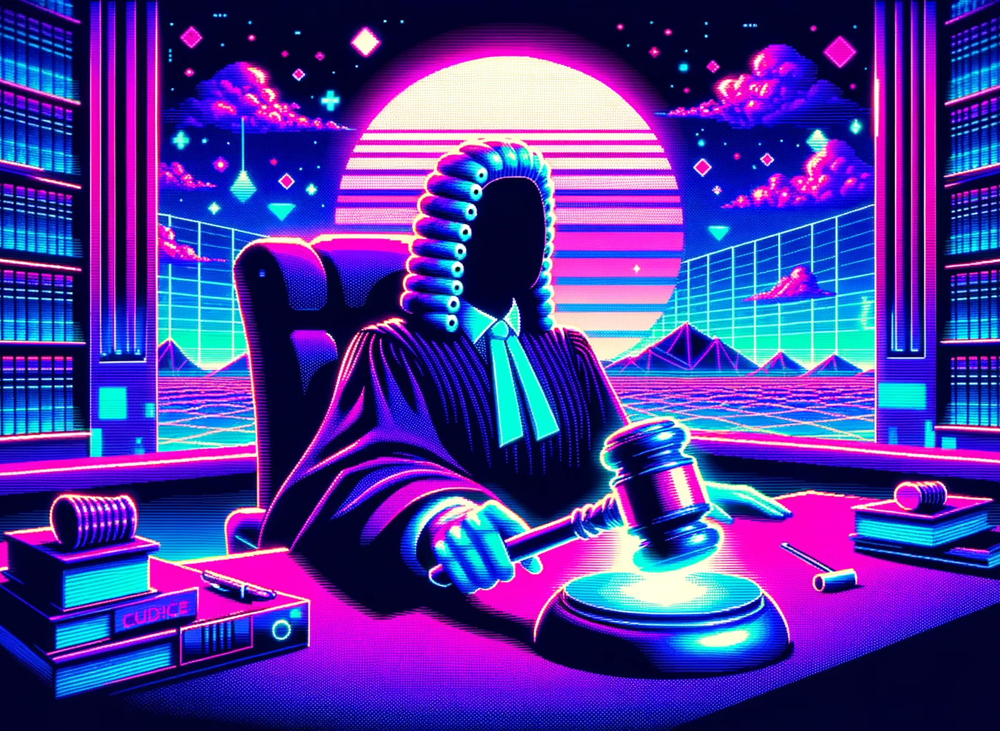

# Do you need trustlessness?

Most computer systems rely on a central trusted party. When you send an email through Gmail or Outlook, you are trusting Google and Microsoft not to tamper with your messages. Likewise, if you make a phone call through your mobile carrier network, you are trusting them to connect you to the right person and not to alter or spy on your conversation.

Trustlessness means the distribution of trust from a central player to the system itself. The idea behind a trustless system is that you do not need to trust the say-so of an authority to be sure that the system is obeying the rules.   

## Trust means no cheating

Trust is another way of saying that you expect someone to abide by shared rules. In other words: the other will not cheat. This can take many forms, for example expecting a business you're buying something from to abide by the law, or expecting a friend to keep their promise.

Trust is contextual. If I buy a laptop in a northern European country, I trust them to abide by the legally required free 2-year warranty period. After all, if they don't then there are strong institutions that will enforce the law. When I travel to countries with weaker institutions, the local law is only half my consideration. The other half is whether I trust a person or business to abide by them. A great/terrible example of this is taxis. The weaker a country's institutions, the more paranoid you need to be about taxis at airports.

> While growing up, my summers were spent in what was formerly called Yugoslavia. Those countries have a rich culture, and I could always rely on summers filled with warmth and good vibes. That said, it was also not uncommon to bribe police officers if my dad was speeding. And I knew not to buy a new cellphone there, because the warranty policy was basically "I have never seen that phone in my life". If you, like me, grew up as a child of two cultures of which one is high trust and one is low trust, you understand how hard it is for those cultures to understand each other. If I take friends from northern Europe to the old Yugoslav region, I try to keep a close eye on them so they keep their money, goods, and safety. Conversely, my family from there has a hard time understanding the impulse for timeliness and lawfulness that is typical for the Dutch.

## Trust is efficient

Trust between parties makes cooperation fast and cheap. If someone you trust deeply asks to borrow €1000,- you would probably make a verbal agreement and conclude within minutes. If your work asks you to front a 1000,- bill and promises to reimburse it, you'd probably ask for a written confirmation that they will pay it back. If a stranger asks, you'd probably require them to provide proof of credit and would insist on a signed contract so you can take them to court if they don't repay you.

Trust reduces friction and cost. The same is true in the world of digital infrastructure. You probably trust that your email provider keeps your emails safely backed up, so you don't insist on making the effort to manually back them up every week. Likewise, I as a programmer trust that Google and Amazon have reliable infrastructure. So I am happy to pay them to provide infrastructure for my applications.

## Without trust, cooperation halts

Take the arena of geopolitics. Why are international agreements so hard between certain players? Often it comes down to the fact that they do not trust each other to hold up their side of the bargain. This is true of many potentially existential threats to humanity: nuclear weapons, biotechnology, cyber security, and environmental concerns.

If there was a genie that would enforce agreements, then agreements would be much easier to make. This is true on both the small and large scale. If we had a trust genie, we could for example:

- Do commerce between businesses in low-trust countries and consumers in other countries, e.g. I could order coffee directly from a farmer from a country with weak institutions and not worry that they simply take my money and send me no coffee
- Make global agreements about important issues like nuclear weapons proliferation, and we wouldn't need to fear secret arms programs from our most feared adversaries
- Make deals between countries, without the fear that a new government would simply opt out and renege on the deal

The above however are pipedreams in real life, because there is no trust genie. We either make deals with those we trust or those we can punish if they betray us, or we don't take our agreements seriously.

## Trust can be externalised

If you could guarantee that a counterparty would be held to their word, then you would be able to deal with them even if you do not trust them. One way of doing this is going through a trusted third party. If you buy a house in the Netherlands, this usually goes like this:

1. You win the bid on a house
2. You sign a paper at a notary saying you will pay
3. The seller signs a paper saying they will sell
4. You pay the notary (not the seller)
5. Once the house is registered to your name and you have the keys, the seller gets their money

In this transaction, you do not need to fear that the seller will take your money and doesn't give you the house. The reason is that the trusted notary facilitates the transaction. No trust in the seller's reputation was needed for you to sleep at night.

This externalisation of trust doesn't need to be to a person, it can be to a system. An example of this is credit cards: a merchant doesn't need to trust your creditworthiness. If the credit card system clears your transaction, they are satisfied that they will get their money.

## Blockchains scatter trust

A decentralised trustless ledger is architected in such a way that participants do not need to trust each other. This is done through a combination of cryptography and game theory:

- the design of the system prevents cheating
- those who run the system are punished financially if they do not enforce the rules

When we say "trustless", we mean to say that we moved trust from individual actors to the system. And because the system is run by a large and diverse set of actors, we trust that the system will abide by its rules. The cryptography and game theory behind this is very interesting, but also beyond the scope of this piece.

In effect, that means that people who interact with a blockchain do not need to trust the actors who are interacting with it alongside them. The rules of the system are enforced by design. For example:

- when swapping a dollar token for euro tokens, the person exchanging their tokens does not need to trust that their counterparty will send them their euros once they send the dollars: the system will enforce this
- when making a transaction on a blockchain, there is no need to trust a verifying institution that the transfer actually happened, the system guarantees that it did

## If you trust your counterparties, don't use a blockchain

Remember: trust is efficient. If you are designing a piece of software, and you trust all players involved, then using a blockchain can be a very expensive decision.

If you are building a hospital system that records medical data, you likely trust the people using it. They are likely to be doctors and nurses who you trust with patients' lives. Making the record-keeping system trustless should probably be very low on your priority list.

There is a caveat to this: even if you trust an institution's intentions, you can question their security level. Even if a company or government does not intend to leak the private information they have, or to modify their systems to cheat people out of their money, they are still one hack away from being forced to do so by someone with less stringent ideals. Trust should always include a component of "what is the worst that couls happen".

> In 2017, hackers gained access to Equifax. This company is the source of credit scored for citizens of the United States[^For non-US readers: they score people based on their borrowing/payback behaviour and decided letting a company do that is a good idea. They get points for borrowing money (e.g. through credit cards) and paying it back on time, and they lose points for delinquency]. This compromised (in varying degrees) the usernames, passwords, home addresses, phone numbers, dates of birth, social security numbers, credit card numbers, and drivers licence numbers of Equifax users. The moral of the story: trusting Equifax was a reasonably position to take, but even well-intentioned entities can have their trusted position exploited.

## Example: Trust makes the financial world go round

Trust is a fundamental aspect of the world's financial infrastructure. Take for example the periodic bank transfer I make from my bank in the Netherlands to my tea vendor in Japan[^This is a real example, few people consume as much ceremonial grade Matcha tea as I do]. This transfer is not done from my bank to the next, it is done through several intermediaries. I don't know the specific route my money takes, but the journey is likely not unlike this:

1. I tell [Wise](https://wise.com) to transfer money to the vendor
2. I transfer money from my bank to Wise's bank account
3. Wise contacts an intermediary bank that has a relationship with the Japanese vendor's bank
4. The money goes from Bunq (my bank) to Wise, to an unknown intermediary bank, to an unknown Japanese bank, to the small bank that my vendor banks at

The transferring of money between these banks doesn't happen using an armoured truck. It means the banks update their internal spreadsheets and trust that the other banks will complete the end-of-day (or multi-day) settlement or make some other form of repo arrangement.

If you have no idea what "settlement" or "repo" means in this context: the summary is that banks trust each other to settle debts among themselves eventually. Depending on how much they trust each other, they charge a fee that reflects the effort and riskiness of the transaction.

> Fun fact: these international transfer systems are very archaic on a technological level. The first time I transferred money to by tea vendor, the bank **lost** the transfer. I'm not joking, it took 2 weeks of emailing and calling before the bank **found** the transfer. I can only imagine someone was faxing documents back and forth and sent them to the wrong department or something.

Generally, banks often have reasons to trust each other. The reasons for that trust often include government regulations and shared messaging systems like SWIFT. But that trust isn't absolute. If it was, then an international transfer would not be as slow (days to weeks) and expensive (percentages) as it is.

It is notable that transferring money to countries with low trust is slower and more expensive. Last year I transferred money to a friend in Ecuador, which took over a week to arrive and cost a ridiculous amount of money. Compare that to transferring money to my Dutch friends: it is free and takes a few seconds to arrive.

An example of an interesting blockchain application that leverages trustlessness is the aforementioned USDC token. While we trust Circle to abide by the off-chain (read: not on a blockchain) rules they set for the USDC token, the transfers are seamless and trustless.

Earlier this year I paid a Colombian freelancer some money for a job. We did the transfer on a blockchain, and he got his money within a minute, and it cost only a few cents[^For those interested, we transferred the money on a layer-2 blockchain called Arbitrum, which specialises in low-cost transactions]. Contrast that to the weeks it took for my Japanese vendor to get his money.