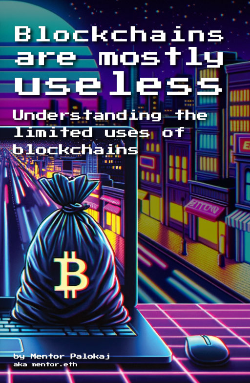

# Blockchains are mostly useless

This book concisely covers why blockchains are unsuited to most tasks, and in which cases they can be useful. It is available for free in a digital format, and for sale on Amazon as a paperback.

- <a href="https://l.palokaj.co/bamu">✉️ Click here to get the latest pdf & epub in your email</a>
- <a href="#">📚 Click here to view the Amazon paperback page</a>

Alternatively, you can also find the publishing history and the associated files in the [release](https://github.com/actuallymentor/blockchains-are-mostly-useless/releases/) section of this repository.

## What others say

> This book offers a unique perspective essential for both enthusiasts and skeptics of blockchain technology. Regardless of personal beliefs, it provides context and enhances understanding, making it a must-read.
>
> ~ Rudy Dogum of the [Wholesome Crypto Podcast](https://www.wholesomecrypto.com/)

> As someone involved in the blockchain industry, I know how hard it is to critique our foundational technology. This book effectively communicates that blockchain technology isn't a universal solution; rather, it's a tool with specific use cases. 
> 
> ~ Werner Hoffman of [Pekuna advisory](https://pekuna.de/homepage)

> This book is for those that want to learn more about blockchains, but don’t know where to start. Mentor will help you realize you know very little and then give you the tools to explore this mostly unknown world by yourself.
>
> ~ Liesbeth van den Berg of the [Proof of Attendance Protocol](https://poap.xyz)

## The goal of this book

> 💡 This is an exerpt from the first chapter of the book

This book aims to give you a framework with which to analyse things people say about blockchains. It is meant for those that are confronted with crypto fanatics and want a framework for telling what the ratio of truth to nonsense is in what they are saying.

This book aims to prepare you for dealing with scenarios that are common when interacting with fanatic proponents of blockchains. Common examples include:

- family members shilling you crypto investments that will "change the world"
- people trying to convince you to invest time or money into their blockchain-powered project

While the majority of this book is about spotting nonsense on the pro-blockchain side, it will inadvertently also prepare you to deal with uneducated but loud voices that are against all things blockchain. Common scenarios include:

- public personalities that claim improbable things like "crypto is the reason we have drug cartels"
- vocal technologists that claim the reason they dislike blockchains is "because they understand computer science"

## Why you should listen to me

> 💡 This is an exerpt from the second chapter of the book

The world of crypto and blockchains is filled with very loud voices, many of whom barely understand what a blockchain is. There are many reasons for you to distrust me. If you grab a few random accounts on Twitter associated with a topic like "blockchains" I wouldn't be surprised if there is an 80% chance any one of them should not be taken seriously.

If you distrust me, that is a healthy position to start from. That said, there are reasons for you to hear me out. The core of these are:

1. I am a programmer, who actually codes applications that interact with blockchains
2. I have been around the crypto space since 2013, I am more sceptical than you
3. My opinions have nuance, and I'm happy to change them

As a programmer, I have built "regular" applications that have nothing to do with blockchains and continue to do so. Within the blockchain space, I have:

- created [signer.is](https://signer.is/), an open-source tool used to do crypto-wallet things like making cryptographic signatures or creating payment links
- written all the (on- and off-chain) code for an NFT project called [the Rocketeers](https://rocketeer.fans/) for a community I enjoy being a part of
- contributed to the applications of the [Proof of Attendance Protocol](https://poap.xyz/) which is my current employer (and has nothing to do with this book)

I've been involved in the blockchain community (if that can be said to exist) for a while. I'm by no means a key player in any aspect of it but have a very visible record of not being a complete idiot, some illustrations of this are that I:

- was [interviewed by Bitcoin magazine](https://bitcoinmagazine.com/culture/an-interview-with-mentor-palokaj-of-bluevpn-1374705552) in 2013, which honestly was because I was advertising my VPN side project and they were nice
- [participated](https://app.poap.xyz/token/2331056) in the Ethereum crowd sale. It was on a student budget, so I'm not as rich as that statement makes it sound
- [Translated the Ethereum Mist wallet](https://github.com/ethereum/mist/pull/618), which was the first official Ethereum wallet, to my native Dutch in 2016

As far as my opinions go, I am not going to fit into a neat bucket of "crypto bro" or "crypto sceptic". I see blockchains like any programming tool: as useful as their suitability to a task. And they are completely unsuitable for the vast majority of applications programmers make. As a general rule, I'm very comfortable with changing my opinion on most things, and I see doing so as a sign of intellectual growth.

## Want to talk?

If you have questions or comments, please feel free to reach out on [Twitter/X](https://twitter.com/actuallymentor).