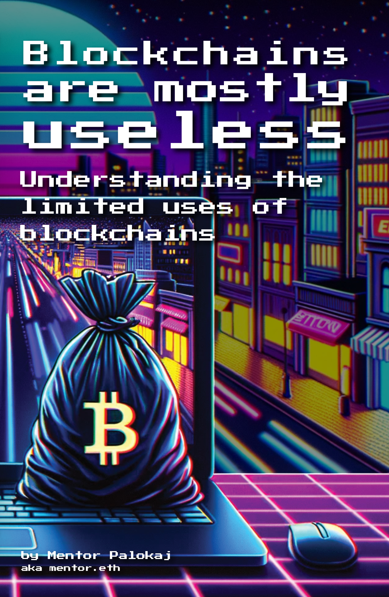

		

	    
		
    

	

		
This book was first published in 2024. The last known edit was on %%LASTEDIT%% (%%BOOKVERSION%%).

		
The content of this book is for educational purposes only. The author disclaims liability for any and all financial or other outcomes that may occur as a result of applying the methods suggested in this book.

		
Copyright 2024 by Mentor Antoni Palokaj. All rights reserved.

	

	<h1>Free update notice</h1>
	
You are entitled to an always up-to-date link to free digital pdf, kindle and kobo versions. Scan the QR code below or go to l.palokaj.co/bamu on your phone.
 
	
The digital versions of this book have clickable links, so I highly recommend getting a copy so you can read the sources at your leasure.

	

	<h1>Acknowledgements</h1>
	
Many thanks to the people who provided feedback on the drafts of this book: Bram, Tom, Werner, Micho, Leonie, Rudy, Liesbeth. A special thanks to my wife Mylène, who has let me rant about blockchains to her for a good decade now, I'm sorry it wasn't just a phase love.

